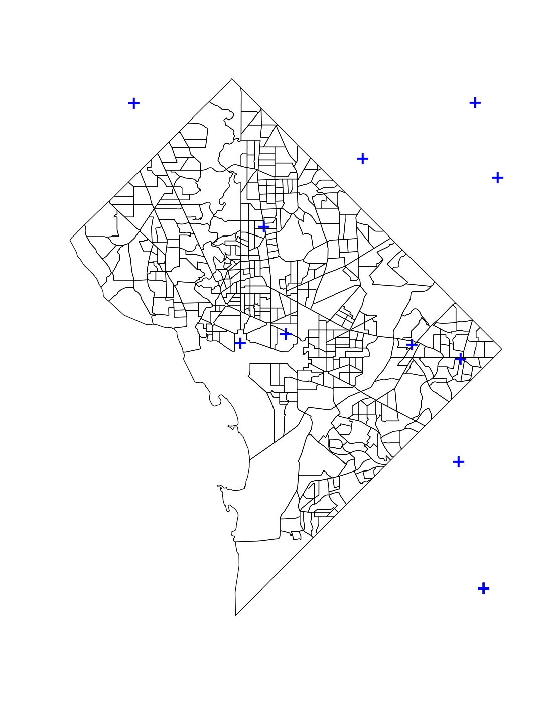

# Social media -- Twitter data

This chapter briefly discusses the use of Twitter data in research and outlines one way of obtaining some data using the Twitter APIs and R. 

The file [twitter_analysis.R](./twitter_analysis.R) contains the code required to collect and map the data.

